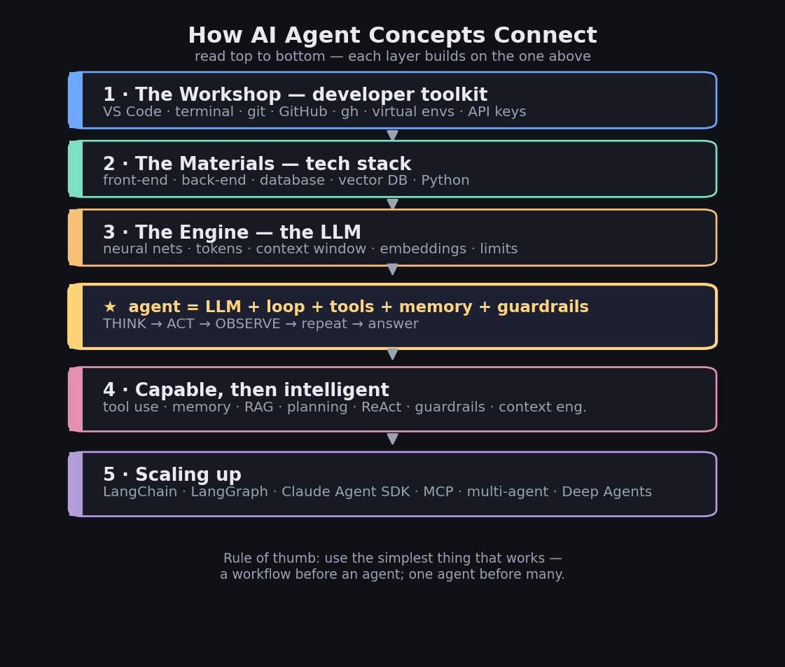

# Learning AI Agents


A beginner-friendly path to understanding **and** building AI agents — written in
plain language, with diagrams and runnable code. No prior AI experience needed.

It has two parts: a **guide** that explains every concept from the ground up, and
a **starter project** that lets you build a real agent by hand and watch it work.

### 🌐 Live site

- **Read the designed guide →** https://aishakauser.github.io/learning-ai-agents/docs/Building-AI-Agents-Guide-Designed.html
- **Explore the interactive concept map →** https://aishakauser.github.io/learning-ai-agents/docs/AI-Agents-Concept-Map.html

<p align="center">
  
</p>

## What you'll learn

- **The foundations** — what a code editor, terminal, git, GitHub, and the GitHub CLI (`gh`) actually do, and how a tech stack fits together.
- **How the "brain" works** — LLMs, tokens, the context window, neural networks, and embeddings, explained without jargon.
- **What makes something an agent** — tools/function calling, memory, RAG, and the think → act → observe loop.
- **How to make an agent reliable** — planning, reasoning patterns (ReAct, reflection), guardrails, evaluation, and context engineering.
- **The ecosystem** — LangChain, LangGraph, the Claude Agent SDK, MCP, multi-agent systems, and Deep Agents (with Hermes Agent as a real-world example).
- **By doing** — you build a working agent yourself, in three gradual levels.

## Contents

### 📘 `docs/` — learn the concepts
- **`Building-AI-Agents-Complete-Guide.md`** — the complete, jargon-free guide in 8
  parts, from the developer toolkit all the way to Deep Agents. Includes diagrams
  and a glossary.
- **`Building-AI-Agents-Guide-Designed.html`** — the full guide as a polished,
  designed web page (editorial layout, redrawn diagrams). Open in any browser; prints to a clean PDF.
- **`AI-Agents-Concept-Map.html`** — the one-page visual map (above) as an
  interactive page. Open it in any browser.

### 🛠️ `research-agent-starter/` — build a real agent
A tiny agent built **by hand** (no framework) so you can see the
think → act → observe loop run. Three levels you build up gradually:

| File | Adds |
|---|---|
| `agent.py` | **Level 1** — web search (Claude's built-in) + a calculator |
| `agent_level2_memory.py` | **Level 2** — remembers the chat + saves durable facts |
| `agent_level3_rag.py` | **Level 3** — answers from your own documents (RAG) |

The big lesson: the agent loop barely changes between levels — you only add
capabilities. See `research-agent-starter/README.md` for full setup.

## Quick start

```bash
cd research-agent-starter
python -m venv .venv && source .venv/bin/activate    # Windows: .venv\Scripts\activate
pip install -r requirements.txt
cp .env.example .env          # paste your key from console.anthropic.com
python agent.py
```

## The one-line idea

> An **agent** = an **LLM** + a **loop** + **tools** + **memory** + **guardrails**.

Everything in the guide is a variation on that sentence.

---

*Built as a learning project. The code is original; the guide is written for people
new to AI agents. Contributions and corrections welcome.*

## License

MIT — free to use, learn from, and share.
